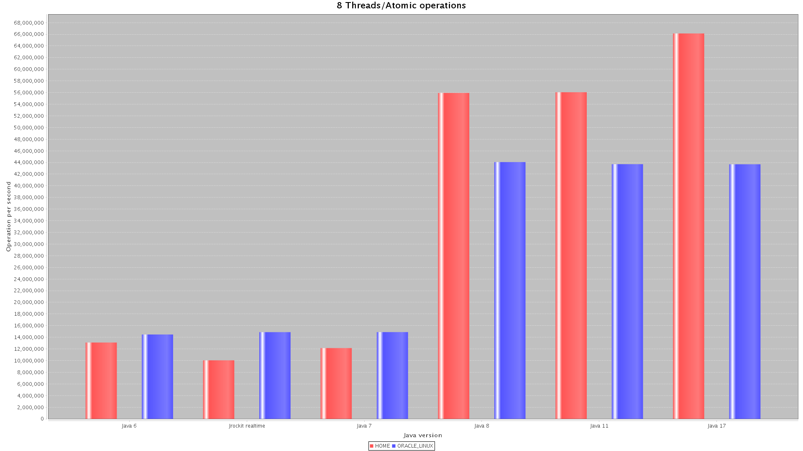

if your ima******ge is like this ↓**

### then use this ↓ (Add width or style attribute)

------------------------OR-----------------------------

# if your image is like this ↓

# then use this ↓

--------------------Explanation------------------------- Replace this format
-> 
with this -> 
